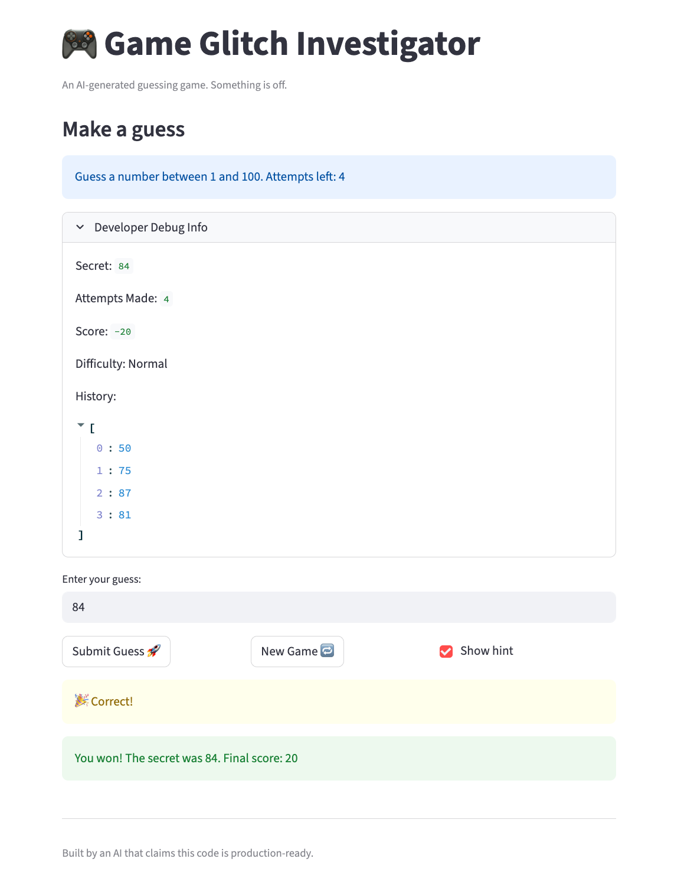

# 🎮 Game Glitch Investigator: The Impossible Guesser

## 🚨 The Situation

You asked an AI to build a simple "Number Guessing Game" using Streamlit.
It wrote the code, ran away, and now the game is unplayable. 

- You can't win.
- The hints lie to you.
- The secret number seems to have commitment issues.

## 🛠️ Setup

1. Install dependencies: `pip install -r requirements.txt`
2. Run the broken app: `python -m streamlit run app.py`

## 🕵️‍♂️ Your Mission

1. **Play the game.** Open the "Developer Debug Info" tab in the app to see the secret number. Try to win.
2. **Find the State Bug.** Why does the secret number change every time you click "Submit"? Ask ChatGPT: *"How do I keep a variable from resetting in Streamlit when I click a button?"*
3. **Fix the Logic.** The hints ("Higher/Lower") are wrong. Fix them.
4. **Refactor & Test.** - Move the logic into `logic_utils.py`.
   - Run `pytest` in your terminal.
   - Keep fixing until all tests pass!

## 📝 Document Your Experience

- **Describe the game's purpose.**
  - The application is a number guessing game where the player tries to guess a secret number within a set range and a limited number of attempts. The game provides feedback on whether the guess is too high or too low and is intended to be a fun, simple browser-based experience built with Streamlit.
- **Detail which bugs you found.**
  - I found three primary bugs. First, the game's hints were inverted, telling the player to go "LOWER" for low guesses and "HIGHER" for high ones. Second, the secret number appeared to change on every other guess, which was caused by the number being converted to a string. Finally, the "New Game" button was broken; after a game ended, clicking it would cause a "Game over" error instead of starting a new round.
- **Explain what fixes you applied.**
  - To fix the game, I first corrected the conditional logic in the `check_guess` function to provide accurate hints. I then removed the code that was incorrectly converting the secret number to a string, ensuring the comparisons were always stable. Lastly, I fixed the "New Game" button by adding logic to reset the game's `status`, `score`, and `history` in Streamlit's session state, allowing the game to restart properly.

## 📸 Demo

- 

---

## 🚀 Stretch Features

- [ ] [If you choose to complete Challenge 4, insert a screenshot of your Enhanced Game UI here]

## 🧑‍🏫 TF Summary

The core concept of this activity is for students to master conditional logic and state management by debugging a broken Streamlit application. Many students will likely struggle with the state management aspect, specifically understanding why the "New Game" button fails without resetting the `status` variable in `st.session_state`. AI is helpful for pinpointing simple logical errors, like the inverted hints, but can be misleading if asked to "fix the game," as it may refactor code without explaining the critical state management concepts. To get the most out of the tool, students must prompt the AI to reason through Streamlit's execution flow and the purpose of `session_state`. As a TF, I would guide a student by asking them to use the Developer Debug Info expander to trace how `st.session_state.status` changes and why a value of `"lost"` prevents the app from rerunning correctly.
